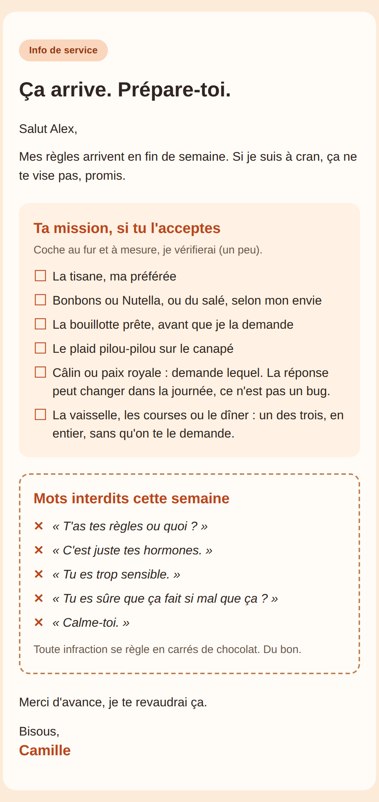

# Ça arrive (bêta)

**Le mot qui prévient la personne qui partage votre vie, quelques jours avant vos règles.** Un skill
gratuit pour les agents d'IA qui lisent le format ouvert [Agent Skills](https://agentskills.io) :
Claude Code, Codex, Cowork, Hermes, OpenClaw. Un skill, c'est un mode d'emploi que votre agent suit
quand vous l'appelez.

> **Version bêta.** Le skill a été essayé en conditions réelles cette semaine, pas encore sous
> Windows, et il va encore bouger au fil de vos retours. Un accroc, une idée ? Écrivez à
> ludo@synoptia.fr.

<p align="center"></p>

## Ce qu'il fait

- Il estime, à partir de vos dates, le moment où vos prochaines règles devraient arriver, et vous dit
  à partir de quel jour le mot sera prêt : ce jour-là, vous relancez le skill et il le prépare. Il ne
  tourne pas en arrière-plan. Si vos cycles varient beaucoup d'un mois à l'autre, il n'estime rien
  et ne porte aucun jugement : il vous montre la durée de vos derniers cycles, vous demande s'il
  manque une date ou s'il y en a une de trop, et prépare le mot le jour où vous le lui demandez.
- Le mot est un mail mis en page, dans l'une des quatre ambiances : **douceur**, **complice**,
  **franc** ou **cash**. Il contient une liste à cocher (la tisane, la bouillotte prête, « câlin ou
  paix royale : demande lequel »...) et, si vous le voulez, une rubrique **« mots interdits cette
  semaine »**, dont vous gardez, changez ou supprimez chaque ligne. Les quatre ambiances ont aussi
  quelques phrases toutes prêtes, modifiables de la même façon. Les listes de départ s'appuient sur des
  études, des témoignages de femmes et des articles de conseil, dont certains publiés par des
  marques : les sources, avec leur nature, sont dans
  [`ca-arrive/references/sources.md`](ca-arrive/references/sources.md).
- Le mot est écrit à la première personne et signé de votre nom, avec vos mots.
- Le skill n'envoie jamais rien : vous copiez le mot et vous l'envoyez depuis votre messagerie. Une version
  texte est prête pour un SMS.

Les quatre ambiances en aperçu : [douceur](ca-arrive/assets/apercus/douceur.png),
[complice](ca-arrive/assets/apercus/complice.png), [franc](ca-arrive/assets/apercus/franc.png),
[cash](ca-arrive/assets/apercus/cash.png).

## Installation

Il vous faut d'abord un agent d'IA installé sur votre ordinateur, ou Cowork dans l'app Claude : le
skill s'ajoute à cet agent.

1. Téléchargez ce dépôt (bouton vert **Code**, puis **Download ZIP**) et décompressez-le. Vous
   obtenez un dossier `ca-arrive-main/`, qui contient le dossier `ca-arrive/`.
2. Copiez ce dossier `ca-arrive/`, lui seul, dans le dossier des skills de votre agent (tableau
   ci-dessous). Ces dossiers commencent par un point, et le Finder du Mac les cache : le plus simple
   est d'ouvrir le Terminal (Applications > Utilitaires ; `Downloads` est votre dossier
   Téléchargements), d'y coller cette commande, puis d'appuyer sur Entrée (ici pour Claude Code) :

   ```bash
   mkdir -p ~/.claude/skills && cp -R ~/Downloads/ca-arrive-main/ca-arrive ~/.claude/skills/
   ```

   Sous Windows (PowerShell : tapez « PowerShell » dans le menu Démarrer), pour Claude Code :

   ```powershell
   Expand-Archive "$HOME\Downloads\ca-arrive-main.zip" -DestinationPath "$HOME\Downloads" -Force
   New-Item -ItemType Directory -Force "$HOME\.claude\skills" | Out-Null
   Copy-Item -Recurse -Force "$HOME\Downloads\ca-arrive-main\ca-arrive" "$HOME\.claude\skills\"
   ```

   Pour Codex ou OpenClaw, remplacez `.claude` par `.agents` dans ces commandes, aux deux endroits ;
   pour Hermes (Mac et Linux), par `.hermes`. Pour Cowork, compressez le dossier `ca-arrive/` en ZIP et téléversez-le dans Customize > Skills.
3. Pour Claude Code, Codex ou Hermes, lancez l'agent dans le Terminal depuis le dossier privé du
   skill, puis appelez le skill (`/ca-arrive` dans Claude Code et Hermes, `$ca-arrive` dans Codex) :

   ```bash
   mkdir -p ~/.ca-arrive && cd ~/.ca-arrive && claude
   ```

   Sous Windows (PowerShell) :

   ```powershell
   New-Item -ItemType Directory -Force "$HOME\.ca-arrive" | Out-Null
   Set-Location "$HOME\.ca-arrive"
   claude
   ```

   Pour Codex, remplacez `claude` par `codex` dans ces commandes ; pour Hermes (Mac et Linux), par
   `hermes`. Les conversations du skill sont ainsi repérées par ce dossier, et « tout effacer » saura
   les retrouver. Pour OpenClaw et Cowork, voyez le tableau. Au premier
   lancement, le skill vérifie son dossier privé et vous pose ses questions.

| Agent | Où placer le dossier `ca-arrive/` | Pour le lancer |
|---|---|---|
| Claude Code | `~/.claude/skills/` | `/ca-arrive` |
| Codex | `~/.agents/skills/` | `$ca-arrive` |
| Cowork | téléversez le ZIP dans Customize > Skills | « Utilise le skill ca-arrive » |
| Hermes | `~/.hermes/skills/` | `/ca-arrive` |
| OpenClaw | `~/.agents/skills/` | `$ca-arrive` |
| Un autre agent | consultez la documentation de votre agent | « Utilise le skill ca-arrive » |

Une version de travail (1.1) a été testée en conditions réelles sous Codex le 25/09/2026, et la 1.2
dans l'app Claude le même jour ; la 1.4 en tire une conversation plus courte et le brouillon mis en
page qui s'ouvre sur l'ordinateur. Essayée sur un vrai Mac le 26/09/2026, elle ouvrait bien le
brouillon dans Mail, mais seulement par la voie de secours quand Safari était fermé : la 1.5 lance
Safari elle-même. Pas encore testé sous Windows. Pour les autres agents, le skill suit leur
documentation officielle. Le détail, agent
par agent, est dans [`ca-arrive/INSTALL.md`](ca-arrive/INSTALL.md). Python 3 est conseillé ; sans
lui, la saisie et la capture fonctionnent quand même.

Sources : [Claude Code](https://code.claude.com/docs/en/skills),
[Codex](https://learn.chatgpt.com/docs/build-skills),
[Cowork](https://support.claude.com/en/articles/12512180-use-skills-in-claude) (et la
[structure du ZIP](https://support.claude.com/en/articles/12512198-how-to-create-custom-skills)),
[Hermes](https://github.com/NousResearch/hermes-agent/blob/main/website/docs/user-guide/features/skills.md),
[OpenClaw](https://docs.openclaw.ai/tools/skills).

## Vos dates : trois façons, au choix

**1. Vous tapez vos dates** (proposé par défaut). L'agent lit ce que vous tapez, qui passe par son
modèle d'IA, en général dans le cloud, comme tout ce que vous lui écrivez. Reste chez vous : votre fichier de
dates, et la trace de la conversation que garde votre agent.

**2. Vous montrez une capture** de votre appli. L'agent lit l'image entière (recadrez sur le
calendrier), qui passe par le modèle d'IA. Reste chez vous : votre capture et la copie éventuelle
qu'en garde votre agent (à supprimer ensuite), et les seules dates que vous confirmez.

**3. Vous passez par l'export** de votre appli (Apple Santé, Clue, Flo). Un petit programme en
extrait les premiers jours sur votre ordinateur ; seules ces dates passent par le modèle d'IA. Reste
chez vous : l'export complet, qui ne quitte pas votre ordinateur (à supprimer ensuite), et votre
fichier de dates. Cette façon n'est proposée que si votre agent tourne sur votre ordinateur :
ailleurs, il faudrait lui envoyer l'export entier.

Le pas-à-pas par application, avec les pages d'aide des éditeurs, est dans
[`ca-arrive/references/exports.md`](ca-arrive/references/exports.md).

## Vos données de santé

Les dates de vos règles sont des données de santé au sens du RGPD (article 9). Le skill les traite
comme telles :

- elles restent dans un dossier privé sur votre ordinateur (`~/.ca-arrive`), que le skill vérifie
  avant d'y écrire : hors de tout dépôt Git et de tout dossier synchronisé. Si votre agent travaille
  ailleurs (Cowork, dont les sessions tournent par défaut dans le cloud, ou un agent installé sur un
  serveur), le skill vous le dit avant d'écrire la moindre date ;
- elles passent par le modèle d'IA de votre agent (chez Anthropic, OpenAI ou le fournisseur que vous
  avez choisi), comme tout ce que vous lui écrivez ; ce qu'il en garde dépend de votre compte ;
- le skill ne garde que la date du premier jour de vos règles, sur vos sept derniers cycles au plus,
  et jamais de symptôme ;
- il n'est pas fait pour un ordinateur ou un compte d'agent partagé, ou administré par quelqu'un
  d'autre (un poste ou un abonnement fourni par votre employeur, par exemple) : il vous pose la
  question au premier lancement ;
- il ne commente jamais votre humeur, votre santé ou vos capacités ;
- il vous dit, pour votre agent, ce qui est conservé et où
  ([`ca-arrive/references/confidentialite.md`](ca-arrive/references/confidentialite.md)) ;
- à votre demande, il supprime vos dates et vos mots, vous donne la procédure de votre agent pour
  effacer la trace de vos conversations, et vous dit ce qu'il ne peut pas effacer lui-même.

Ce n'est pas un outil médical : il ne diagnostique rien, ne sert ni à la contraception ni à un projet
de grossesse, et la date calculée n'est qu'une estimation. Le skill ne transmet rien à Synoptïa, et
télécharger ce dépôt ne demande aucun compte chez nous. Sur GitHub, une étoile, un fork ou une issue
sont publics et liés à votre compte : pour une question personnelle, écrivez plutôt à
ludo@synoptia.fr.

## Au fil des mois

Le jour où vos règles arrivent, lancez le skill avec « c'est arrivé aujourd'hui » (ou « hier ») : il
note la date, et la prochaine estimation en tient compte. Pour estimer la date suivante, il lui faut
au moins trois dates, ou la durée habituelle de votre cycle que votre appli affiche. Avec « le mot maintenant », il prépare le mot
tout de suite ; avec « réglages », vous changez l'ambiance, les listes ou le délai ; « pause » et
« reprendre » font ce qu'ils disent.

## Pourquoi il est offert

Il est offert pour circuler le plus largement possible : chacune le prend tel quel ou l'adapte à sa
façon.

Le skill n'envoie rien, et c'est délibéré : l'agent prépare le mot sur le ton que vous avez choisi,
et c'est vous qui décidez s'il part.

D'autres skills sont offerts à l'inscription sur l'espace de Synoptïa :
[espace.synoptia.fr](https://espace.synoptia.fr).

## Licence, garantie et responsabilité

Ce skill est distribué gratuitement sous licence MIT (texte officiel en anglais dans
[`LICENSE`](LICENSE), repris dans `ca-arrive/LICENSE.txt`). Elle couvre tout le contenu créé pour ce
skill : code, textes, gabarits et aperçus. Les courtes citations reprises dans
`ca-arrive/references/sources.md` restent à leurs auteurs. En résumé : vous pouvez l'utiliser, le
copier, le modifier et le partager, y compris à des fins commerciales, à condition de garder la
mention de copyright et la licence. Il est fourni « tel quel », sans garantie, notamment sur
l'exactitude de la date calculée, qui n'est qu'une estimation. Le texte officiel exclut aussi la
responsabilité des auteurs et du titulaire des droits (SYNOPTIA). Si vous l'utilisez à titre
personnel, ni cette absence de garantie ni cette exclusion ne limitent les droits que vous tenez du
Code de la consommation, ni votre droit à réparation d'un dommage causé par un manquement de
Synoptïa ; pour un usage professionnel, elles s'appliquent dans la mesure permise par la loi.

Les noms d'agents, d'applications et de produits cités (Claude Code, Cowork, Codex, Hermes, OpenClaw,
Apple Santé, Clue, Flo, Nutella) sont des marques de leurs titulaires. Ce skill n'est affilié à aucun
d'eux ni approuvé par eux.

## Éditeur

Synoptïa (SYNOPTIA, SARL à associé unique au capital de 5 000 €, RCS Manosque 991 606 781).
Contact : ludo@synoptia.fr. Mentions légales, dont le directeur de la publication :
https://synoptia.fr/mentions-legales. Le dépôt est hébergé par GitHub, Inc., 88 Colin P. Kelly Jr.
Street, San Francisco, CA 94107, États-Unis (github.com).
